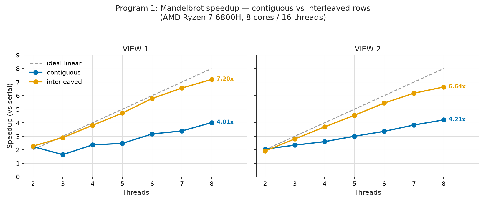

# CS149 Assignment 1 — Performance Analysis on a Multi-Core CPU

**Names / SUNet IDs:** _[FILL IN — group member name(s) and SUNet ID(s)]_

## Test environment

All results were collected on a **local AMD Ryzen 7 6800H** (8 physical
cores / 16 hardware threads via 2-way SMT, AVX2 + FMA, DDR5 dual-channel),
running under WSL2, not on the Stanford myth machines (no access). ISPC
v1.28.1, GCC 13, `-O3`.

This differs from the assignment's reference machine (Intel i7-7700K, 4
cores / 8 threads), so **absolute speedup numbers and some curve shapes
differ from the handout's expectations** — e.g. speedup ceilings are ~8x
(cores) rather than ~4x, and the 32x target in Program 3 is comfortably
exceeded. Where relevant this is noted per section. Toolchain fix: the
starter code needed `<cstring>` / `<cstdlib>` includes added to compile on
GCC 13.

---

# Program 1 — Parallel Fractal Generation Using Threads

Image 1600x1200, maxIterations=256. Timings are the min of 5 runs.

## Step 1 — Two-thread spatial decomposition (top/bottom half)

| Threads | View | Serial (ms) | Thread (ms) | Speedup |
|--------:|:----:|------------:|------------:|--------:|
| 2       | 1    | 356.6       | 175.0       | 2.04x   |

~2x (even slightly super-linear). The Mandelbrot set is symmetric about the
real axis (y=0); VIEW 1's y-range [-1,1] is centered on 0, so the top and
bottom halves carry nearly identical work → the two threads finish at almost
the same time, giving a well-balanced ~2x.

## Step 2 — Contiguous-block decomposition, 2..8 threads (speedup graph)

Thread i computes contiguous row-block i; the last thread absorbs the
remainder rows.

**VIEW 1**

| Threads | Serial (ms) | Thread (ms) | Speedup |
|--------:|------------:|------------:|--------:|
| 2 | 398.8 | 179.0 | 2.23x |
| 3 | 344.4 | 209.6 | **1.64x** |
| 4 | 341.4 | 144.6 | 2.36x |
| 5 | 341.8 | 138.2 | 2.47x |
| 6 | 344.4 | 108.7 | 3.17x |
| 7 | 342.9 | 101.1 | 3.39x |
| 8 | 343.0 | 85.5  | 4.01x |

**VIEW 2**

| Threads | Serial (ms) | Thread (ms) | Speedup |
|--------:|------------:|------------:|--------:|
| 2 | 300.5 | 146.5 | 2.05x |
| 3 | 212.1 | 90.5  | 2.34x |
| 4 | 203.2 | 78.2  | 2.60x |
| 5 | 205.4 | 68.5  | 3.00x |
| 6 | 204.2 | 60.7  | 3.36x |
| 7 | 206.0 | 53.8  | 3.83x |
| 8 | 204.3 | 48.5  | 4.21x |

**Is speedup linear? No.** 8 threads reach only ~4x, not 8x. The cause is
**load imbalance**: pixels are not equal cost. The black interior of the set
costs the full 256 iterations per pixel, while exterior pixels escape in a
few iterations. Whichever thread's block overlaps the heavy interior does
most of the work, and the whole render waits for that slowest thread.

The **3-thread dip in VIEW 1 (1.64x, below the 2-thread 2.23x)** is the
tell: in VIEW 1 the heavy interior sits in the vertical center. With 2
threads the top/bottom split is symmetric about y=0, so the heavy center
divides evenly → balanced ~2x. With 3 threads the *middle* block captures
almost the entire heavy center while the top and bottom blocks are cheap →
the middle thread dominates → speedup collapses toward (total work /
middle-block work) ~1.6x. VIEW 2 is a zoomed-in region with a more even
spread of heavy pixels across rows, so it shows no 3-thread dip.

## Step 3 — Per-thread timing (confirms the load-imbalance hypothesis)

**3 threads, VIEW 1 (the anomaly)**

| Thread | Rows | Time (ms) |
|-------:|:-----|----------:|
| 0 | [0, 400)    | ~68  |
| 1 | [400, 800)  | **~213** |
| 2 | [800, 1200) | ~72  |

The middle thread does ~3x the work of the edges. Wall time (211 ms) is set
by thread 1 alone; sum of per-thread times (~354 ms) ≈ serial (352 ms) —
work isn't added, just unevenly split. Middle block ≈ 60% of work → speedup
capped near 354/213 ≈ 1.66x, matching the measured 1.67x.

**2 threads, VIEW 1 (balanced):** thread 0 = 177.9 ms, thread 1 = 180.2 ms —
nearly equal (symmetric about y=0) → ~2x.

**8 threads, VIEW 1 (severe imbalance):** per-thread times range from 6.2 ms
(edge rows 1050-1200) to 96.0 ms (central rows 600-750) — a ~15x spread.
Wall time is bounded by the slowest thread (~96 ms): 343/96 ≈ 3.6x ≈ the
measured ~4x.

**Explanation of the graph:** parallel time is set by the *slowest* thread,
not the average. Because the heavy interior clusters in the vertical center,
contiguous blocks give the central thread(s) far more work. Adding threads
shrinks each block but the central block stays relatively heavy, so speedup
grows slowly and non-monotonically (3 threads worst).

## Step 4 — Interleaved (round-robin) decomposition (final policy)

Thread i computes rows i, i+numThreads, i+2·numThreads, … (stride =
numThreads). This scatters the heavy central rows evenly across all threads,
so every thread gets a near-identical mix of heavy and cheap rows. **No
synchronization** (threads write disjoint rows), a **single policy for all
thread counts**, and height-not-divisible-by-numThreads is handled for free
(row indices ≥ height are never claimed).

| Threads | VIEW1 blocks | VIEW1 interleaved | VIEW2 blocks | VIEW2 interleaved |
|--------:|-------------:|------------------:|-------------:|------------------:|
| 2 | 2.23x | 2.27x | 2.05x | 1.91x |
| 3 | **1.64x** | **2.90x** | 2.34x | 2.80x |
| 4 | 2.36x | 3.81x | 2.60x | 3.69x |
| 5 | 2.47x | 4.71x | 3.00x | 4.55x |
| 6 | 3.17x | 5.79x | 3.36x | 5.45x |
| 7 | 3.39x | 6.56x | 3.83x | 6.18x |
| 8 | 4.01x | **7.20x** | 4.21x | **6.64x** |

Per-thread times are now balanced (3 threads VIEW 1 = 122/122/122 ms, was
68/213/72). The dip is gone; speedup is monotonic and near-linear.
**Final 8-thread speedup: VIEW 1 = 7.20x, VIEW 2 = 6.64x** (~90% / ~83%
efficiency on 8 cores), meeting the 7-8x target.

## Step 5 — 16 threads vs 8 threads (SMT)

The machine has 8 physical cores with 2-way SMT (AMD's name for Intel's
Hyper-Threading) = 16 hardware threads. Interleaved policy, min of 5, ×3:

| Run | VIEW1 8thr | VIEW1 16thr | VIEW2 8thr | VIEW2 16thr |
|----:|-----------:|------------:|-----------:|------------:|
| 1 | 7.57x | 9.80x | 7.17x | 7.80x |
| 2 | 7.42x | 9.16x | 6.61x | 8.32x |
| 3 | 7.46x | 9.45x | 7.32x | 8.14x |

**Is 16 noticeably faster than 8? No — only ~+20-30%, not 2x.** Threads
9-16 do not get new physical cores; they pair with threads 1-8 on the same 8
cores via SMT. Mandelbrot is compute-bound (a tight FP iteration keeping the
FP units busy), so few idle execution slots remain for the second SMT
thread. Evidence: at 16 threads each thread computes 75 rows (half of the
8-thread 150) yet takes ~47-83 ms — as long as the 8-thread workers took for
twice the rows — because two threads share one core's execution units at
~55-60% of full-core speed.

---

# Program 2 — Vectorizing Code Using SIMD Intrinsics

Uses CS149's *fake* vector intrinsics (simulated), so results are
independent of the host CPU. Performance = Total Vector Instructions;
utilization = fraction of vector lanes active across all vector
instructions.

## Task 1 — Vectorize clampedExpSerial → clampedExpVector

Approach: process the array in batches of VECTOR_WIDTH lanes. Per batch,
`result = 1.0` in all lanes, multiplied by x once per unit of the exponent,
masking off lanes whose exponent counter has reached 0. Looping until every
lane is done handles the per-lane variable trip count (SIMD divergence);
starting from 1.0 also folds in the y==0 case. Clamp lanes > 9.999999 with a
compare-mask + masked set. Tail (N % VECTOR_WIDTH != 0): init counts to 0 in
all lanes, then load only the first `width` lanes via `_cs149_init_ones(width)`
— unused lanes are never loaded/stored, so no out-of-bounds access.

| Test | Result | Total Vec Instr | Utilization |
|------|--------|----------------:|------------:|
| ./myexp -s 3     | Passed | 36    | 86.1% |
| ./myexp -s 16    | Passed | 155   | 86.8% |
| ./myexp -s 10000 | Passed | 97071 | 82.7% |

(-s 3 exercises the N < VECTOR_WIDTH tail path.)

## Task 2 — Utilization vs VECTOR_WIDTH (./myexp -s 10000)

| VECTOR_WIDTH | Total Vec Instr | Vector Utilization |
|-------------:|----------------:|-------------------:|
| 2  | 167515 | 87.9% |
| 4  | 97071  | 82.7% |
| 8  | 52877  | 80.0% |
| 16 | 27592  | 78.8% |

**Utilization DECREASES as VECTOR_WIDTH increases** (with a shrinking
decrement toward an asymptote). All wasted lane-slots come from the
data-divergent multiply loop. Exponents are uniform in [0, 9]; a batch's
loop runs max(exponents in the batch) iterations, and on iteration k only
lanes with exponent ≥ k are active. As width grows, (1) the max exponent in a
batch tends larger (max of more samples) → longer loop, and (2) more lanes
idle during those extra iterations. Both raise the wasted fraction. The
non-divergent instructions (load/store/vset/clamp) are always fully utilized.

## Task 3 (extra credit) — arraySumVector, O(N/W + log₂ W)

1. Accumulate all N elements into a width-wide accumulator with N/width
   vector adds (lane j holds the sum of elements at indices ≡ j mod width).
2. Reduce the width partial sums with log₂(width) rounds of `hadd` (sum
   adjacent pairs, duplicated) + `interleave` (even indices to the front
   half, odd to the back). After the last round every lane holds the grand
   total; return lane 0.

Verified Passed for VECTOR_WIDTH = 2, 4, 8, 16.

---

# Program 3 — Parallel Fractal Generation Using ISPC

Image 1200x800, maxIterations=256. `--target=avx2-i32x8`,
`--opt=disable-fma`. Times are min of 3 runs.

## Part 1 — Single-core SIMD (no tasks)

The compiler emits 8-wide AVX2, and (per the handout) we assume ~as many
8-wide vector FP units as scalar FP units, so the **ideal SIMD speedup is
8x** on one core.

| View | Serial (ms) | ISPC (ms) | Speedup | Fraction of 8x |
|:----:|------------:|----------:|--------:|---------------:|
| 1 | 249.9 | 43.2 | 5.78x | 72% |
| 2 | 155.2 | 31.4 | 4.95x | 62% |

**Why less than 8x: SIMD divergence.** A gang of 8 instances executes in
lockstep; each pixel's `mandel()` loop runs until it escapes (up to 256
iterations). When the 8 pixels differ in escape count, the gang iterates
until the longest finishes; finished lanes are masked off and idle. Those
idle lane-slots are wasted → speedup < 8x.

**Why VIEW 2 (4.95x) < VIEW 1 (5.78x):** VIEW 1 has large uniform-cost
regions (deep interior all hit 256; far exterior all escape quickly) — only
the thin boundary ring has high variance. VIEW 2 zooms into the
boundary/filament region where iteration counts vary sharply pixel-to-pixel,
so nearly every gang mixes cheap and expensive pixels → severe divergence.

## Part 2 — ISPC tasks

**Baseline (starter: launch[2]):** VIEW 1 = 10.73x, VIEW 2 = 8.67x — only
~1.8x over no-task ISPC, since two tasks occupy at most two cores.

**Methodology note:** a naive back-to-back sweep of task counts was
misleading — the serial baseline itself drifted from ~260 ms to ~150 ms as
the 45W laptop chip warmed and throttled. Candidates were therefore
benchmarked in **interleaved rotation** (A,B,C,… repeated, medians reported)
so thermal state affects all equally.

**Task-count sweep (VIEW 1, median of interleaved rounds):**

| Tasks | Rows/task | Median speedup |
|------:|----------:|---------------:|
| 2   | 400 | ~12.1x (baseline) |
| 16  | 50  | 36.5x |
| 32  | 25  | 67.2x |
| 50  | 16  | **71.7x** |
| 100 | 8   | 67.3x |
| 160 | 5   | 67.3x |
| 400 | 2   | 51.3x |

Plateau at 32-160; 5-round head-to-head picked **50 tasks × 16 rows**.

**Why 50?** The task system creates one worker per *logical* CPU (16 here)
pulling from a shared queue. Too few tasks (16 = 1/worker) gives no
rebalancing slack — contiguous blocks put the heavy center in one task,
capping the run (~36x). ~3 tasks/worker (50) lets a worker that finishes a
cheap block grab the next, dynamically smoothing the imbalance, while each
task is still large enough to amortize scheduling overhead (~69x). Too many
(400 × 2 rows) lets per-task overhead eat the gains (~51x).

**Final results (50 tasks):**

| View | Serial (ms) | ISPC (ms) | Task ISPC (ms) | SIMD | Total |
|:----:|------------:|----------:|---------------:|-----:|------:|
| 1 | 151.3 | 25.3 | 2.10 | 5.98x | **72.17x** |
| 2 | 91.6  | 18.1 | 1.88 | 5.06x | **48.68x** |

Both comfortably exceed the 32x target (which assumed 4-core myth machines).
The multicore factor (72.2/5.98 = 12.1x) exceeds the 8 physical cores — see
Program 4 for the SMT/DVFS analysis of why.

## Extra credit — Thread abstraction vs ISPC task abstraction

- **`std::thread`** is an **OS execution context**: its own stack (~8 MB),
  register state, kernel scheduling entity; creation is a heavyweight
  syscall; `join()` waits on a *specific* thread.
- **An ISPC task** is a **logical unit of work** (function pointer + small
  descriptor) pushed on a queue; a small persistent worker pool (≈one per
  logical CPU, created once) runs tasks to completion; the implicit `sync`
  is a *collective* barrier.

**10,000 threads:** on 8 cores at most ~16 run at once; the rest are pure
overhead — ~80 GB of stack address space, tens of µs each to create
(seconds total), and scheduler collapse (constant context switching,
cache/TLB thrashing, run-queue contention).

**10,000 tasks:** nothing dramatic — the ~16 pool workers dequeue and run
them one after another; descriptors are tens of bytes (a few MB total); no
new OS contexts; "scheduling" is a queue pop. Throughput is bounded by the
cores (our sweep showed 400 tasks still at ~51x; 400 threads would not fall
over, but 10,000 would).

**Why it matters:** tasks **decouple logical parallelism from hardware
parallelism** — the program expresses any number of independent pieces and
the runtime multiplexes them onto fixed hardware with dynamic load balancing
(exactly how 50 tasks smoothed the heavy-center imbalance in Part 2). With
raw threads the programmer maps work to hardware, and oversubscription hurts.
Also: collective sync composes for nested parallelism where per-thread joins
don't; OS threads are preemptable and may block safely while tasks assume
short non-blocking work; and each ISPC task additionally carries a SIMD gang,
so one runtime manages both cores and vector units. In one line: a thread is
an *execution resource* you allocate; a task is a *piece of work* you
describe.

---

# Program 4 — Iterative `sqrt`

N = 20,000,000 floats, initialGuess = 1.0, tolerance 1e-5. Newton iteration
for 1/y²−x=0; output = x·y = √x. Iteration count depends on x: 0 at x=1
(guess is exact), largest near x=3 (~20). Times are min of 3.

## Task 1 — Baseline (uniform random in [0.001, 2.999])

| Run | Serial (ms) | ISPC (ms) | Task ISPC (ms) | SIMD | Total |
|----:|------------:|----------:|---------------:|-----:|------:|
| 1 | 659.9 | 132.8 | 11.37 | 4.97x | 58.06x |
| 2 | 651.1 | 129.3 | 11.11 | 5.04x | 58.62x |
| 3 | 659.2 | 131.1 | 10.11 | 5.03x | 65.20x |

**SIMD speedup ~5.0x** (vs ideal 8x → ~63% utilization): uniform-random
input means iteration counts vary widely across a gang's 8 lanes, so gangs
iterate until the slowest lane converges — the divergence of Program 3.

**Multi-core factor (tasks/no-tasks) ~12x** — *more* than the 8 physical
cores. The following analysis (verified with experiments) explains why.

### Why the multicore factor exceeds 8 (SMT) — mechanism

Not branch misprediction (the while-exit branch is highly predictable) and
not "masked lanes leaving bubbles" (AVX2 instructions issue full-width;
`objdump` of our binary shows the Newton loop is four chained `vmulps` on
one register followed by a `vblendvps` that overwrites converged lanes — the
vector unit computes converged lanes redundantly, wasting lane *output*, not
issue slots). The real cause is the **loop-carried FP dependency chain**:
`guess_{n+1} = f(guess_n)`. Occupancy arithmetic: 4 chained muls × 3-cycle
latency = ≥12 cycles; one iteration is ~17-20 cycles issuing ~5 muls →
mul-pipe occupancy 5/(2 pipes × 17) ≈ **15%**. So a single thread leaves
~85% of the FP issue slots empty, and the sibling SMT thread's independent
chain fills them. Theory bounds SMT gain in (1x, 2x) and, far from
saturation, predicts ~2x.

**Co-residency experiment (two processes, ispc-no-tasks phase):**

| Placement | ispc time each |
|:----------|:---------------|
| solo (cpu0)                        | 131-133 ms |
| same core (cpu0 + sibling cpu1)    | 133-135 ms |
| different cores (cpu0 + cpu2)      | 133-134 ms |

Two latency-bound loops sharing one core interfere ~zero → per-core ~2x,
matching the 15%-occupancy prediction.

**What actually caps the multicore factor: DVFS, not scheduling.**
- N-scaling (20M→80M): per-core factors unchanged (1.51→1.47 at 16 logical;
  0.92→0.89 at 8 physical) → the deficit is per-cycle, not fixed overhead.
- Frequency test (cpu0 single thread, its SMT sibling idle throughout):

  | Chip state | cpu0 ispc time | relative speed |
  |:-----------|:---------------|:---------------|
  | idle                          | 130.4 ms | 1.00 |
  | other 7 physical cores loaded | 152.0 ms | 0.86 |
  | other 14 logical CPUs loaded  | 182.7 ms | 0.71 |

  The 45W laptop chip throttles as its power budget spreads across cores.
  Reconciliation: 16-logical per-core = 2×0.714 = 1.43 (measured 1.47);
  8-physical = 0.857 (measured 0.90). The speedup denominator (ispc-no-tasks)
  is measured at single-core boost, so multicore speedups on this chip are
  structurally capped by DVFS. (This also explains Program 3's 12.1x.)

Sources: agner.org / uops.info (vmulps Zen 3: latency 3, throughput 0.5 = 2
mul pipes); wikichip Zen 3; Tullsen et al., ISCA 1995 (SMT); Hennessy &
Patterson Ch. 3 (out-of-order execution).

## Task 2 — Input that maximizes speedup: all values = 2.999f

Worst convergence in the valid range (~20 iterations): the serial
denominator is maximized AND every gang lane converges in lockstep → zero
divergence.

| Metric | Baseline (random) | All 2.999f |
|:-------|------------------:|-----------:|
| Serial (ms) | ~655 | ~1363 (2.08x slower) |
| SIMD speedup (no tasks) | 5.0x | **6.6-6.7x** |
| Multicore factor | ~11.7-12x | ~11.5x |
| Total speedup | 58-65x | **74.5-78.9x** |

- **Improves SIMD speedup? Yes** (5.0→6.6x, ~82% of ideal 8x): zero
  divergence keeps all lanes active; the remaining gap is per-iteration
  compare/mask/blend/test overhead that issues even when all lanes are busy.
- **Improves multi-core speedup? No** (~11.5x, unchanged): divergence is an
  intra-core lane-level property; cross-core scaling depends on core count /
  SMT / DVFS, not the input's per-element iteration spread.

## Task 3 — Input that minimizes ISPC (no-tasks) speedup

Period-8 pattern `(i % 8 == 0) ? 2.999f : 1.0f` — one slow element (~20
iterations) + seven instant-converging elements per gang. Serial skips 7/8
of the array almost free, but every gang is held hostage by its single slow
lane and iterates ~20 times with 7/8 of the lanes masked off. Period 8
guarantees exactly one slow element per gang regardless of lane mapping.

| Metric | Value |
|:-------|------:|
| Serial (ms) | ~186 |
| ISPC (ms)   | ~202 (≈ all-2.999f's 205 ms, as predicted) |
| **Speedup** | **0.91-0.93x — the vector version is SLOWER than serial** |

**Reason for the loss:** the gang's loop runs max(iterations in gang) times;
masked-off lanes idle but still cost full-width compare/blend/test
instructions each iteration — the vector unit does ~8x the instruction issue
for 1/8 the useful lanes.

**Divergence trend across all three constructed inputs:**

| Input pattern | Lane utilization (theory) | SIMD speedup (measured) |
|:--------------|--------------------------:|------------------------:|
| all 2.999f (uniform)        | 100%  | 6.6-6.7x |
| alternating 4 slow + 4 fast | 52.5% | 3.33x |
| 1 slow + 7 fast (period 8)  | ~17%  | **0.92x** |

Measured speedup ≈ 8 × utilization × ~0.8 overhead across all three points —
the divergence model matches quantitatively.

---

# Program 5 — BLAS `saxpy`

N = 20M floats/array; `result = 2·X + Y`.

## Task 1 — Baseline and why tasks barely help

| Impl | Time (ms) | Bandwidth\* | GFLOPS |
|:-----|----------:|------------:|-------:|
| ISPC (1 core) | 10.9-11.6 | 25.7-27.3 GB/s | 3.4-3.7 |
| ISPC + tasks  | 7.5-7.7   | 38.7-39.6 GB/s | 5.2-5.3 |
| **Speedup from tasks** | | | **1.45-1.51x** |

\*As the program counts it: TOTAL_BYTES = 4·N·4B (see extra credit).

**Evidence — the machine's bandwidth ceiling** (a STREAM-triad scratch
benchmark with the same access pattern, GB/s at 16B/element):

| Threads | GB/s |
|--------:|-----:|
| 1 | 29.9 / 32.8 |
| 2 | 42.1 / 40.3 |
| 4 | 44.1 / 42.6 |
| 8 | 42.7 / 40.4 |
| 16 | 41.0 / 40.7 |

**The ~40-44 GB/s ceiling is reached with only 2 threads** — the memory
controller saturates; more cores just queue. Single-core saxpy (27 GB/s) is
already near one core's fill rate; with tasks (39-40 GB/s) it is at ~92% of
the physical limit, so the 1.45-1.51x is essentially all the headroom that
exists (40/27 ≈ 1.5).

**Arithmetic intensity:** 2 FLOPs / 16 bytes = 0.125 FLOP/B. At 40 GB/s that
is 5 GFLOPS (measured) vs the chip's ~500+ GFLOPS peak → the CPU is ~1% busy
computing; the program is **purely memory-bound**.

**Can it be substantially improved / near-linear? No.** Near-linear (8x)
would need ~216 GB/s, 5x beyond the DRAM ceiling. Cores share one memory
system saturated by just 2 of them. The only real lever is *moving fewer
bytes* (non-temporal stores skip the write-allocate read: 16→12 B/elem,
≤1.33x), still nowhere near linear.

**Metric caveat:** the printed GB/s and GFLOPS are (algorithmic-model total)
/ time — no hardware counters. Verified with an amortized triad: for data
that fits in L3 (N=1M) the same formula yields 97 GB/s, and for L1/L2-hot
data (N=100k) 144 GB/s — both above the 76.8 GB/s DRAM physical limit, i.e.
fictitious as DRAM bandwidth because the cache supplied the data. Saxpy's 80
MB arrays make the model valid, so its 26-40 GB/s is genuine DRAM traffic.

## Extra credit 1 — Why TOTAL_BYTES = 4·N·sizeof(float) is correct

Naively the kernel touches 3 words/element (read X, read Y, write result) =
12 B. The 4th word comes from the cache's **write-allocate** (read-for-
ownership) policy:

1. Caches operate on **64-byte lines**, the unit of coherence — a store must
   own the whole line to write it back consistently.
2. Ordinary write-back stores: on a store miss the memory system first
   **reads the full 64B line from DRAM**, merges the 4B store, and later
   **writes the dirty line back** on eviction.
3. Per element (streaming, 16 floats/line, each line fetched once, evicted
   once): read X (4) + read Y (4) + RFO read of result's line (4) +
   write-back of result's line (4) = **16 B = 4 words**.

So true DRAM traffic is 4·N·4B = TOTAL_BYTES. Avoiding the RFO read requires
non-temporal stores (extra credit 2), bounding the gain at 16/12 ≈ 1.33x.

---

# Program 6 — Making K-Means Faster

Data: M = 1,000,000 points, N = 100 dims, K = 3, epsilon = 0.1 (locally
generated — no Stanford AFS access — statistically equivalent). Correctness
checked against starter-generated reference logs and via `plot.py`.

## Step 1 — Profile the main loop (find the hotspot)

Per-function timers around the three phases in the main while-loop:

| Function | Time (ms) | Share |
|:---------|----------:|------:|
| computeAssignments | 5457-5940 | ~68% |
| computeCost        | 1535-1671 | ~19% |
| computeCentroids   |  967-1048 | ~12% |
| iterations         | 24 | |
| Total              | ~8000 | |

**computeAssignments dominates (~68%)** — it does K×M = 3,000,000 `dist()`
calls per iteration over N=100 dims. Secondary suspicion: `dist()` uses
`pow(x,2)` instead of a multiply.

## Step 2 — First cut: pow(diff,2) → diff*diff in dist()

`dist()` is called by all three functions; libm `pow()` is slower than a
multiply. Math-identical (verified: end.log centroids match the starter
reference).

| | Total (ms) | computeAssignments (ms) |
|:-|-----------:|------------------------:|
| Step 1 baseline | ~8000 | ~5700 |
| Step 2 (mult)   | ~6690 | ~4550 |
| **Speedup** | **1.19x** | 1.29x |

Smaller than hoped — at `-O3` the compiler already partly strength-reduces
`pow(x,2)`; the real cost is the 3M-calls/iteration loop itself.

## Step 3 — Parallelize computeAssignments with std::thread (8 threads)

The starter loops centroid-major (k outer, m inner) sharing a per-point
`minDist[]`. I restructured it point-major (m outer, k inner) and split the
M points across 8 threads: each point is written by exactly one thread, so
**no synchronization** and no shared `minDist[]` (it becomes a per-point
local). The main thread does chunk 0; 7 `std::thread`s do the rest; join at
the end. **Only computeAssignments is parallelized** (satisfies the rule).

| Stage | Total (ms) | computeAssignments (ms) |
|:------|-----------:|------------------------:|
| Step 1 baseline    | ~8000 | ~5700 |
| Step 2 (pow→mult)  | ~6690 | ~4550 |
| **Step 3 (8 threads)** | **~2770** | **~580** |

- computeAssignments: 4550 → 580 ms = **7.8x** (near-linear on 8 cores; it's
  compute-bound with disjoint writes, so it scales well).
- **Total speedup vs starter: 8000/2770 = 2.89x** — exceeds the 2.1x target.

Correctness verified: end.log centroids identical to the starter reference,
and `plot.py` produces the expected 3-cluster figure (red-star centroids at
cluster centers). The bottleneck has now shifted to computeCost /
computeCentroids, but the rules allow parallelizing only one function, so
**2.89x is the final result**.
